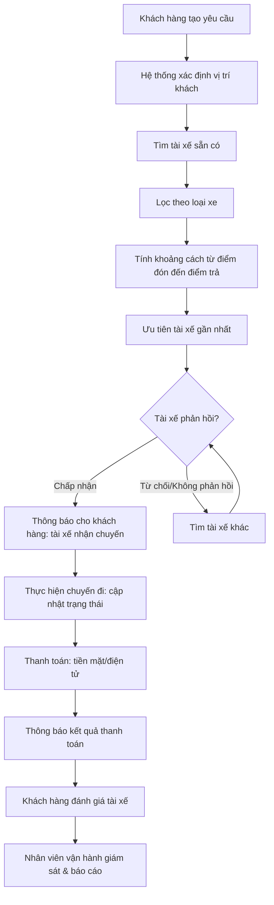
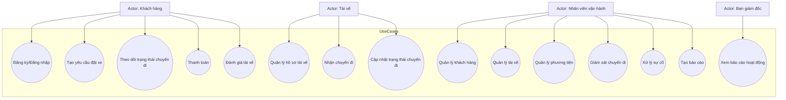

B1.Ngữ cảnh nghiệp vụ

Công ty ABC hiện đang cung cấp dịch vụ đặt xe trực tuyến, nhưng hệ thống hiện tại còn nhiều hạn chế:

Việc phân công tài xế chủ yếu thủ công, gây chậm trễ và thiếu tối ưu.

Khách hàng khó theo dõi trạng thái chuyến đi, thiếu minh bạch.

Thông tin thanh toán chưa được quản lý tập trung, dễ gây sai sót.

Bộ phận vận hành gặp khó khăn khi mở rộng hệ thống, thiếu khả năng giám sát và báo cáo.

Ban lãnh đạo mong muốn xây dựng một nền tảng CAB System mới, có khả năng phục vụ số lượng lớn khách hàng và tài xế, đồng thời dễ dàng mở rộng và tích hợp thêm tính năng trong tương lai.

Business problem (Vấn đề kinh doanh cần giải quyết)

Khách hàng muốn giải quyết các vấn đề chính:

Quy trình đặt xe: hiện tại chưa tự động, gây bất tiện cho khách hàng và tài xế.

Theo dõi chuyến đi: khách hàng không biết rõ trạng thái, dẫn đến trải nghiệm kém.

Thanh toán: chưa có hệ thống tập trung, thiếu an toàn và khó kiểm soát.

Quản trị vận hành: nhân viên khó quản lý tài xế, phương tiện, chuyến đi và báo cáo.

Khả năng mở rộng: hệ thống cũ không đáp ứng nhu cầu tăng trưởng và tích hợp dịch vụ mới.

Vì sao hệ thống hiện tại không thể đáp ứng

Thiếu tự động hóa: phân công tài xế thủ công, không có cơ chế ưu tiên tài xế gần khách hàng.

Thiếu minh bạch: khách hàng không được thông báo đầy đủ về trạng thái chuyến đi.

Thiếu tích hợp: thanh toán điện tử chưa được hỗ trợ đúng chuẩn, dữ liệu không tập trung.

Thiếu khả năng mở rộng: hệ thống không chịu được tải cao, dễ lỗi khi nhu cầu tăng.

Thiếu bảo mật và phân quyền: chưa có kiểm soát truy cập và lưu vết thao tác.

Ai là người tạo yêu cầu

Ban giám đốc công ty ABC: đưa ra kỳ vọng và định hướng xây dựng hệ thống CAB mới.

Nhân viên vận hành: cung cấp yêu cầu thực tế về quản lý, giám sát và xử lý sự cố.

Khách hàng và tài xế: là nhóm người dùng chính, phản ánh nhu cầu về trải nghiệm dịch vụ.

B2.Các stakeholder chính

Khách hàng

Người sử dụng dịch vụ đặt xe.

Vai trò: tạo yêu cầu chuyến đi, theo dõi trạng thái, thanh toán, đánh giá tài xế.

Tài xế

Người cung cấp dịch vụ vận chuyển.

Vai trò: nhận và thực hiện chuyến đi, cập nhật trạng thái, quản lý hồ sơ và phương tiện.

Nhân viên vận hành

Người quản lý hệ thống hàng ngày.

Vai trò: giám sát chuyến đi, hỗ trợ xử lý sự cố, quản lý tài xế/khách hàng/phương tiện, tra cứu giao dịch.

Ban giám đốc

Người ra quyết định chiến lược.

Vai trò: định hướng phát triển hệ thống, yêu cầu báo cáo, giám sát hiệu quả hoạt động.

Nhà cung cấp thanh toán

Đối tác bên ngoài tích hợp dịch vụ thanh toán.

Vai trò: xử lý giao dịch điện tử, đảm bảo an toàn dữ liệu tài chính.

Nhà cung cấp dịch vụ thông báo

Đối tác cung cấp kênh thông báo (SMS, email, push notification).

Vai trò: truyền tải thông tin đến khách hàng và tài xế.

Business Analyst

Người phân tích yêu cầu nghiệp vụ.

Vai trò: làm rõ phạm vi, quy trình, yêu cầu chức năng/phi chức năng, quy tắc nghiệp vụ và ngoại lệ.

| **Stakeholder** | **Vai trò** |
|-----------------|-------------|
| **Khách hàng** | Tạo yêu cầu chuyến đi, theo dõi trạng thái, thanh toán, đánh giá tài xế |
| **Tài xế** | Nhận và thực hiện chuyến đi, cập nhật trạng thái, quản lý hồ sơ và phương tiện |
| **Nhân viên vận hành** | Giám sát chuyến đi, hỗ trợ xử lý sự cố, quản lý tài xế/khách hàng/phương tiện, tra cứu giao dịch |
| **Ban giám đốc** | Định hướng phát triển hệ thống, yêu cầu báo cáo, giám sát hiệu quả hoạt động |
| **Nhà cung cấp thanh toán** | Xử lý giao dịch điện tử, đảm bảo an toàn dữ liệu tài chính |
| **Nhà cung cấp dịch vụ thông báo** | Truyền tải thông tin đến khách hàng và tài xế qua SMS, email, push notification |
| **Business Analyst** | Làm rõ phạm vi, quy trình, yêu cầu chức năng/phi chức năng, quy tắc nghiệp vụ và ngoại lệ |

B3.Tóm tắt Business Goal

| **Business Goal** | **Ý nghĩa** |
|-------------------|-------------|
| Tăng trải nghiệm khách hàng | Đặt xe nhanh chóng, theo dõi chuyến đi, thanh toán minh bạch |
| Tối ưu vận hành | Tự động hóa phân công tài xế, hỗ trợ nhân viên quản lý |
| Mở rộng quy mô | Hệ thống phục vụ nhiều khách hàng/tài xế, ổn định khi tải cao |
| Đảm bảo an toàn và bảo mật | Bảo vệ dữ liệu, kiểm soát quyền truy cập, lưu vết thao tác |
| Hỗ trợ phát triển lâu dài | Kiến trúc linh hoạt, dễ bổ sung dịch vụ và tích hợp mới |

B4. Xác định phạm vi(scope)

Phạm vi trong (In-scope)

Khách hàng

Đăng ký, đăng nhập, quản lý thông tin cá nhân.

Tạo yêu cầu đặt xe, chọn loại xe, theo dõi trạng thái chuyến đi.

Xem lịch sử chuyến đi, thanh toán, đánh giá tài xế.

Tài xế

Đăng ký/được tạo tài khoản, quản lý hồ sơ và phương tiện.

Chuyển trạng thái sẵn sàng, nhận thông báo chuyến đi.

Cập nhật trạng thái chuyến đi (đến điểm đón, đón khách, đang di chuyển, hoàn thành).

Nhân viên vận hành

Quản lý khách hàng, tài xế, phương tiện, chuyến đi.

Giám sát trạng thái hệ thống, xử lý sự cố, tra cứu giao dịch.

Phân quyền quản trị, tạo báo cáo hoạt động.

Thanh toán

Tính cước tự động theo loại dịch vụ và thông tin chuyến đi.

Hỗ trợ thanh toán tiền mặt và điện tử qua nhà cung cấp bên ngoài.

Xử lý lỗi giao dịch và thông báo kết quả cho khách hàng.

Thông báo

Gửi thông báo cho khách hàng và tài xế về trạng thái chuyến đi, thanh toán.

Hỗ trợ mở rộng thêm kênh thông báo trong tương lai.

Bảo mật và vận hành

Xác thực người dùng, kiểm soát quyền truy cập.

Bảo vệ dữ liệu cá nhân, phương tiện, vị trí và giao dịch.

Lưu vết thao tác quan trọng để phục vụ kiểm tra.

Phạm vi ngoài (Out-of-scope)

Chi tiết chính sách hủy chuyến, cách tính cước, tiêu chí ưu tiên tài xế (chưa được chốt, cần BA làm rõ).

Xử lý khi mất kết nối mạng hoặc thời gian lưu trữ dữ liệu (chưa xác định).

Các dịch vụ mở rộng trong tương lai (dịch vụ mới, phương thức thanh toán mới, nhà cung cấp thông báo mới).

B5. Chuyển đổi thành yêu cầu nghiệp vụ

Business Requirements (BR)
BR1 – Quản lý khách hàng  
Hệ thống phải cho phép khách hàng đăng ký, đăng nhập, quản lý thông tin cá nhân, tạo yêu cầu đặt xe, theo dõi trạng thái chuyến đi, xem lịch sử và đánh giá tài xế.

BR2 – Quản lý tài xế  
Hệ thống phải hỗ trợ tài xế đăng ký hoặc được nhân viên vận hành tạo tài khoản, quản lý hồ sơ và phương tiện, chuyển trạng thái hoạt động, nhận và cập nhật trạng thái chuyến đi.

BR3 – Tìm và phân công tài xế  
Hệ thống phải tự động xác định tài xế phù hợp dựa trên vị trí và trạng thái sẵn sàng, xử lý trường hợp tài xế từ chối hoặc không phản hồi, và thông báo cho khách hàng nếu không tìm được tài xế.

BR4 – Thanh toán và tính cước  
Hệ thống phải tính cước tự động theo loại dịch vụ và thông tin chuyến đi, hỗ trợ thanh toán tiền mặt và điện tử qua nhà cung cấp bên ngoài, xử lý lỗi giao dịch và thông báo kết quả cho khách hàng.

BR5 – Thông báo  
Hệ thống phải gửi thông báo cho khách hàng và tài xế về trạng thái chuyến đi, kết quả thanh toán, và có khả năng mở rộng thêm kênh thông báo trong tương lai.

BR6 – Quản lý vận hành  
Hệ thống phải cung cấp giao diện quản trị cho nhân viên vận hành để quản lý khách hàng, tài xế, phương tiện, chuyến đi, phân quyền, giám sát và tạo báo cáo cho ban giám đốc.

BR7 – Bảo mật và ổn định hệ thống  
Hệ thống phải xác thực người dùng, kiểm soát quyền truy cập, bảo vệ dữ liệu cá nhân và giao dịch, lưu vết thao tác quan trọng, đồng thời hoạt động ổn định khi nhu cầu tăng cao và hỗ trợ mở rộng độc lập.

B6.Bysiness process

Business Process chính
Khách hàng tạo yêu cầu

Khách hàng đăng nhập, nhập điểm đón/điểm đến, chọn loại xe và gửi yêu cầu đặt xe.

Hệ thống tìm tài xế

Hệ thống xác định tài xế phù hợp dựa trên vị trí, trạng thái sẵn sàng và tiêu chí vận hành.

Nếu tài xế từ chối hoặc không phản hồi, hệ thống tiếp tục tìm tài xế khác.

Nếu không tìm được tài xế, khách hàng được thông báo.

Tài xế nhận chuyến

Tài xế nhận thông báo và chấp nhận chuyến.

Hệ thống thông báo cho khách hàng về tài xế, thời gian dự kiến đến điểm đón.

Thực hiện chuyến đi

Tài xế cập nhật trạng thái: đến điểm đón → đón khách → đang di chuyển → hoàn thành chuyến.

Khách hàng theo dõi trạng thái qua ứng dụng.

Thanh toán

Sau khi chuyến hoàn tất, hệ thống tính cước tự động.

Khách hàng thanh toán bằng tiền mặt hoặc điện tử qua nhà cung cấp bên ngoài.

Nếu giao dịch thất bại, hệ thống thông báo và cho phép xử lý lại.

Thông báo & đánh giá

Khách hàng nhận thông báo kết quả thanh toán.

Khách hàng có thể đánh giá tài xế.

Tài xế nhận thông báo về trạng thái chuyến hoàn thành.

Quản trị vận hành

Nhân viên vận hành giám sát chuyến đi, quản lý tài xế/khách hàng/phương tiện.

Ban giám đốc nhận báo cáo về số lượng chuyến, doanh thu, tỷ lệ hoàn thành/hủy.

B7.functuinal requirements phân rã

B8. Bysiness rule và exception 

| **Business Rule (BR)** | **Mô tả** |
|-------------------------|-----------|
| BR1 | Xác thực tài khoản: khách hàng/tài xế phải đăng nhập |
| BR2 | Trạng thái tài xế: chỉ tài xế “sẵn sàng” mới nhận chuyến |
| BR3 | Ưu tiên tài xế: gần khách hàng và đúng loại xe |
| BR4 | Thời gian phản hồi: tài xế phải phản hồi trong thời gian quy định |
| BR5 | Tính cước: dựa trên loại dịch vụ, khoảng cách, thời gian |
| BR6 | Thanh toán: không lưu thông tin nhạy cảm, chỉ lưu kết quả |
| BR7 | Thông báo: gửi tại các mốc quan trọng |
| BR8 | Phân quyền quản trị: nhân viên thường không được thao tác nhạy cảm |

| **Exception (EX)** | **Mô tả** |
|---------------------|-----------|
| EX1 | Không tìm được tài xế: thông báo cho khách hàng |
| EX2 | Tài xế từ chối/không phản hồi: hệ thống chuyển sang tài xế khác |
| EX3 | Thanh toán thất bại: thông báo và cho phép xử lý lại |
| EX4 | Mất kết nối mạng: lưu trạng thái tạm thời, đồng bộ lại khi phục hồi |
| EX5 | Hủy chuyến: ghi nhận lý do và cập nhật báo cáo |

B9.Mô hình hóa hệ thống dữ liệu, xác định các thực thể

| **Thực thể** | **Thuộc tính chính** |
|--------------|-----------------------|
| Khách hàng | Mã KH, Họ tên, SĐT, Email, Địa chỉ, Lịch sử chuyến |
| Tài xế | Mã TX, Họ tên, SĐT, Email, Trạng thái, Loại phương tiện |
| Phương tiện | Mã xe, Loại xe, Biển số, Mã tài xế |
| Chuyến đi | Mã chuyến, Điểm đón, Điểm trả, Thời gian, Trạng thái, Mã KH, Mã TX |
| Thanh toán | Mã GD, Phương thức, Số tiền, Trạng thái, Mã chuyến |
| Thông báo | Mã TB, Nội dung, Thời gian, Người nhận |
| Nhân viên vận hành | Mã NV, Họ tên, Vai trò, Quyền hạn |

B10.Xác định yêu cầu phi chức năng

| **Loại NFR** | **Mô tả** |
|--------------|-----------|
| Hiệu năng | Xử lý yêu cầu ≤ 3 giây, phản hồi tài xế ≤ 5 giây |
| Khả năng mở rộng | Hỗ trợ ≥ 10.000 yêu cầu đồng thời, module mở rộng độc lập |
| Bảo mật | Mã hóa dữ liệu nhạy cảm, hỗ trợ MFA cho quản trị |
| Tính sẵn sàng | Độ sẵn sàng ≥ 99.9%, có cơ chế dự phòng |
| Khả năng phục hồi | Phục hồi sau sự cố ≤ 30 phút, sao lưu định kỳ |
| Khả năng tương thích | Hoạt động trên iOS/Android/Web, tích hợp nhiều dịch vụ |
| Khả năng sử dụng | Giao diện thân thiện, hỗ trợ đa ngôn ngữ |

B11. Vẽ các usercase, đặc tả về usercase

| **Use Case** | **Actor** | **Mục tiêu** | **Tiền điều kiện** | **Hậu điều kiện** |
|--------------|-----------|--------------|--------------------|-------------------|
| Tạo yêu cầu đặt xe | Khách hàng | Gửi yêu cầu đặt xe | Đăng nhập, có mạng | Yêu cầu được lưu, hệ thống tìm tài xế |
| Nhận chuyến đi | Tài xế | Nhận và chấp nhận chuyến | Đăng nhập, trạng thái sẵn sàng | Chuyến gán cho tài xế, khách hàng nhận thông báo |
| Thanh toán | Khách hàng | Thanh toán chi phí | Chuyến đi hoàn thành | Thanh toán ghi nhận, báo cáo cập nhật |

B12. Tiêu chí chấp nhận
| **Yêu cầu** | **Tiêu chí chấp nhận** |
|-------------|-------------------------|
| Đăng ký/Đăng nhập | Tạo tài khoản mới, đăng nhập thành công, báo lỗi khi sai |
| Tạo yêu cầu đặt xe | Nhập điểm đón/trả, chọn loại xe, hiển thị trạng thái tìm tài xế |
| Tìm và phân công tài xế | Tìm tài xế gần nhất, xử lý từ chối/không phản hồi, thông báo khi không có tài xế |
| Thực hiện chuyến đi | Tài xế cập nhật trạng thái, khách hàng theo dõi trên ứng dụng |
| Thanh toán | Tính cước chính xác, hỗ trợ tiền mặt/điện tử, xử lý lỗi giao dịch |
| Thông báo | Gửi thông báo cho khách hàng và tài xế tại các mốc quan trọng |
| Quản lý vận hành | Nhân viên quản trị dữ liệu, ban giám đốc xem báo cáo |
| Bảo mật & ổn định | Xác thực người dùng, mã hóa dữ liệu, hệ thống ổn định và phục hồi nhanh |

B.13 Truy xuất nguồn gốc yêu cầu

| **Business Requirement (BR)** | **Functional Requirement (FR)** | **Use Case** | **Acceptance Criteria / Test Case** |
|--------------------------------|---------------------------------|--------------|-------------------------------------|
| BR1 – Quản lý khách hàng | FR1.1 Đăng ký tài khoản, FR1.2 Đăng nhập, FR1.3 Quản lý thông tin | UC1 Đăng ký/Đăng nhập | TC1: Người dùng tạo tài khoản thành công, TC2: Đăng nhập đúng/sai |
| BR2 – Quản lý tài xế | FR2.1 Quản lý hồ sơ, FR2.2 Quản lý phương tiện, FR2.3 Chuyển trạng thái | UC6 Quản lý hồ sơ, UC7 Nhận chuyến | TC3: Tài xế cập nhật hồ sơ, TC4: Nhận chuyến thành công |
| BR3 – Tìm và phân công tài xế | FR3.1 Xác định vị trí khách, FR3.2 Tìm tài xế sẵn có, FR3.3 Lọc loại xe, FR3.4 Tính khoảng cách | UC2 Tạo yêu cầu đặt xe, UC7 Nhận chuyến | TC5: Hệ thống tìm tài xế gần nhất, TC6: Xử lý từ chối/không phản hồi |
| BR4 – Thanh toán | FR4.1 Tính cước, FR4.2 Thanh toán tiền mặt, FR4.3 Thanh toán điện tử | UC4 Thanh toán | TC7: Tính cước chính xác, TC8: Thanh toán điện tử thành công/thất bại |
| BR5 – Thông báo | FR5.1 Gửi thông báo khách hàng, FR5.2 Gửi thông báo tài xế | UC3 Theo dõi trạng thái, UC8 Cập nhật chuyến đi | TC9: Khách hàng nhận thông

