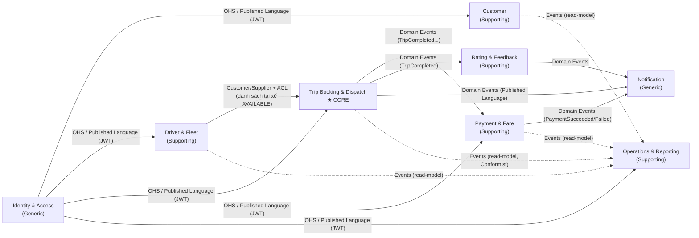
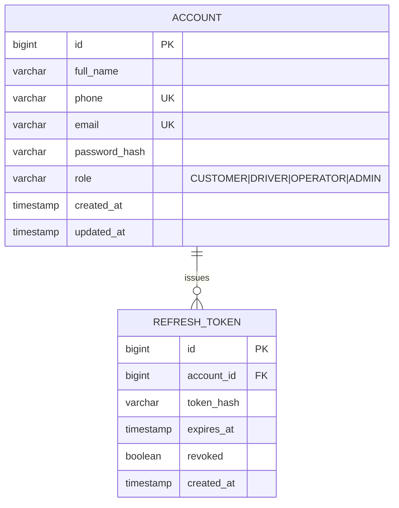
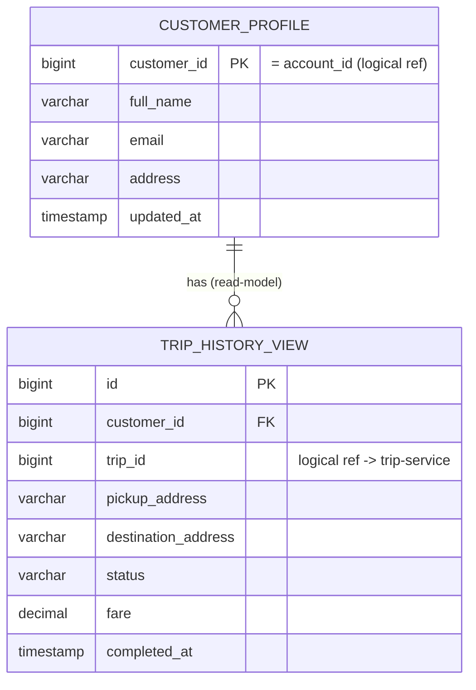
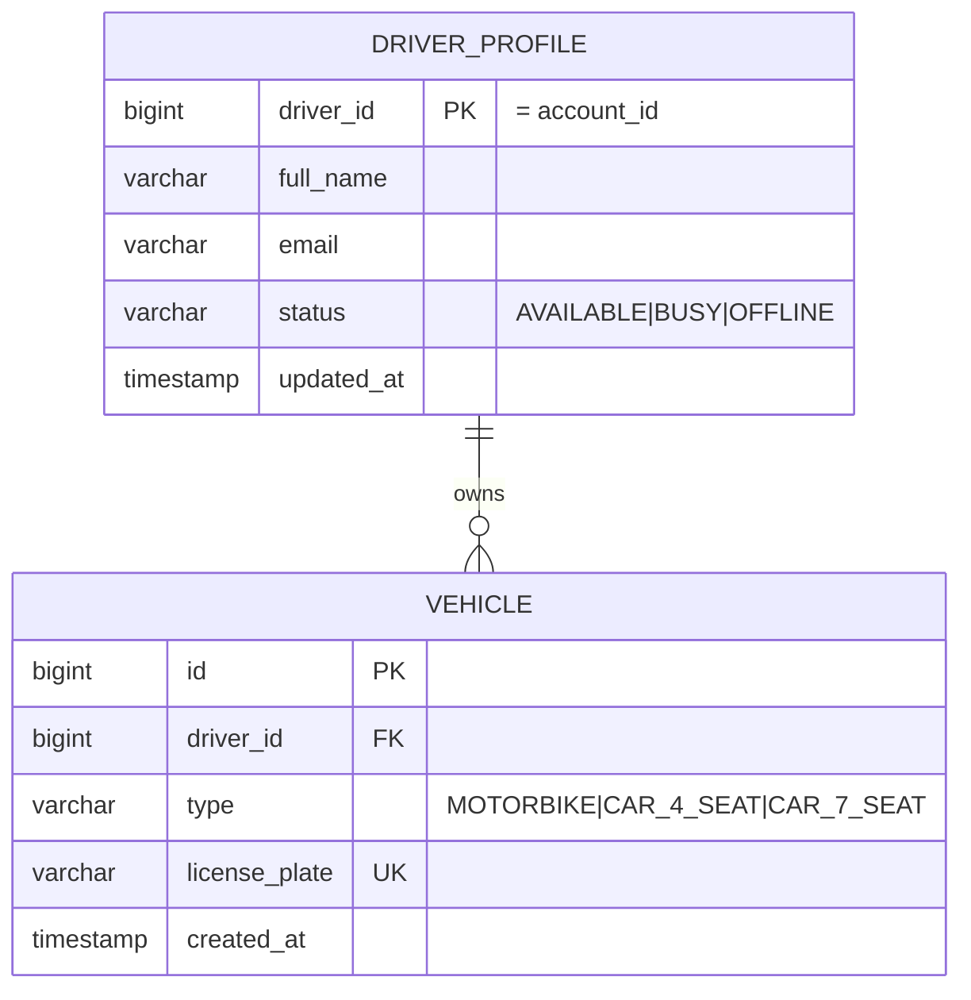
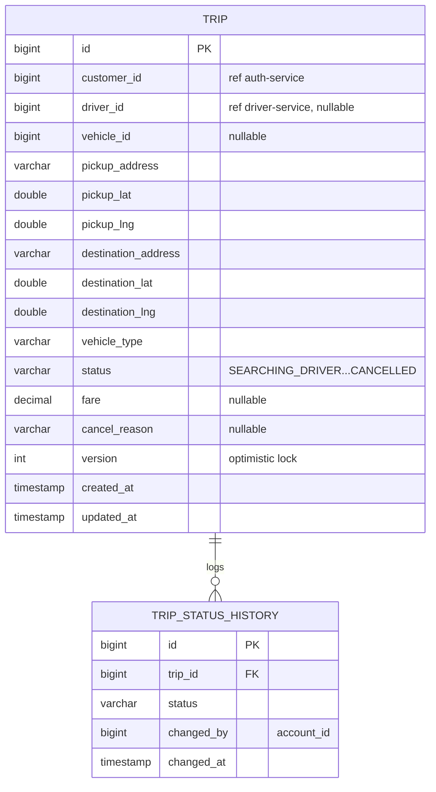
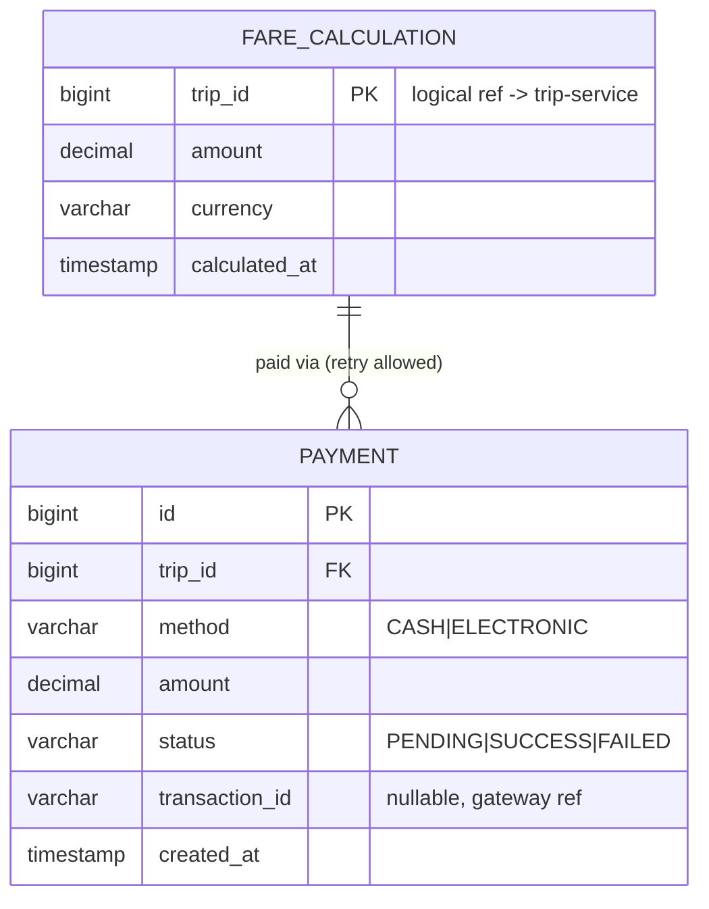
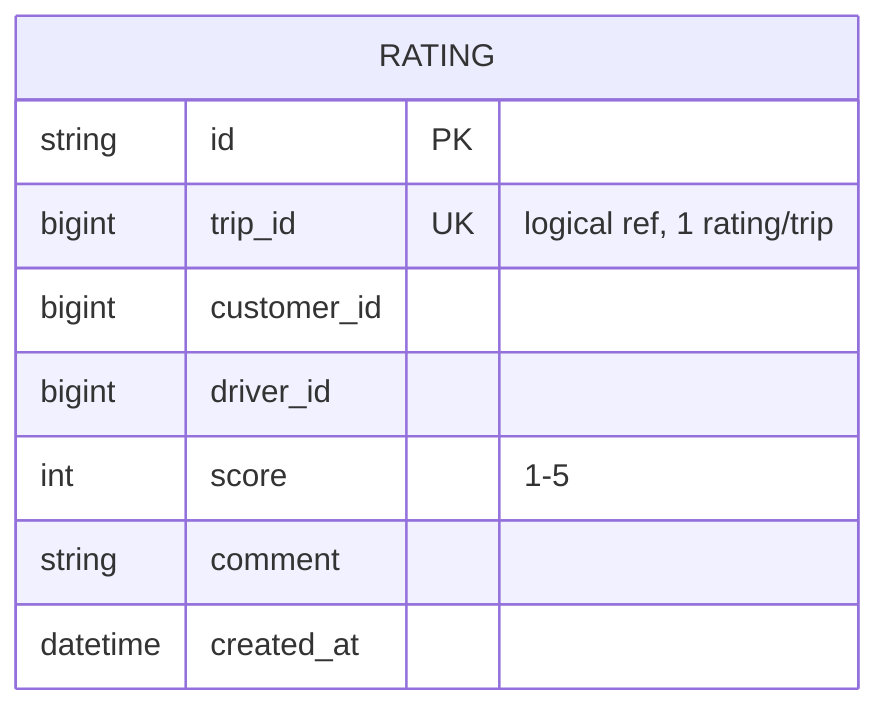
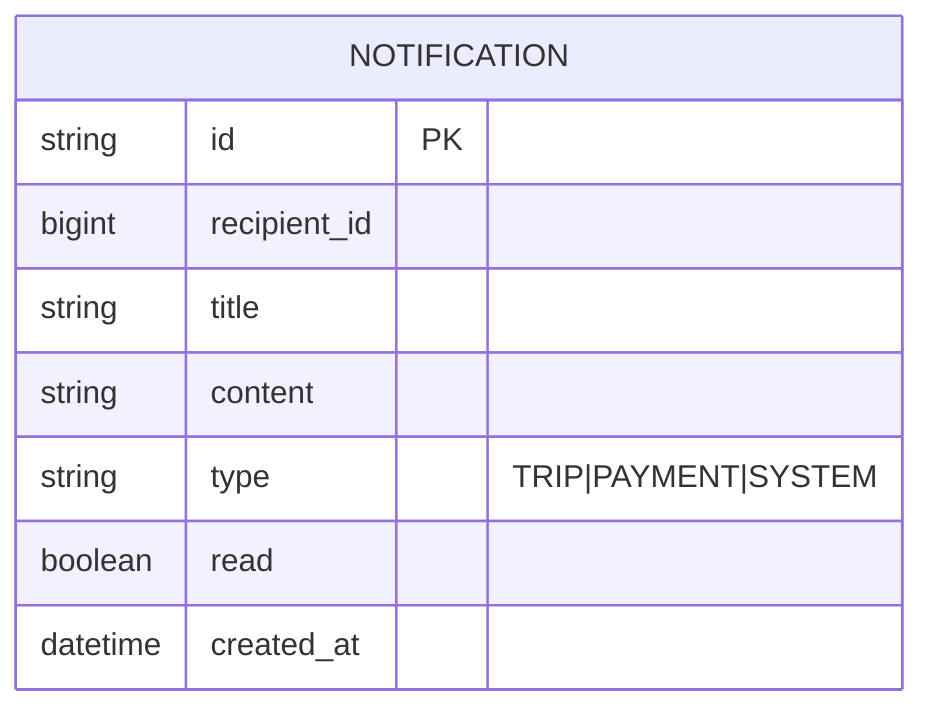
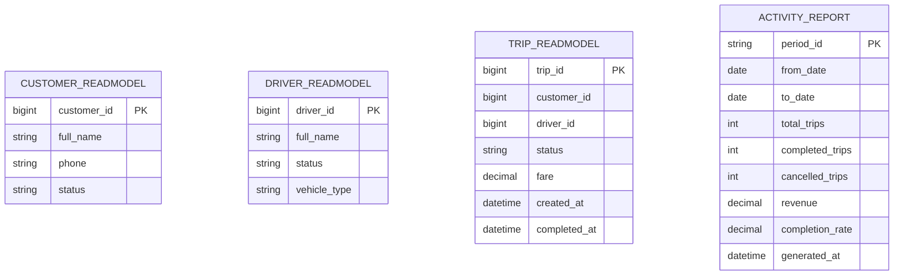

# Thiết kế DDD — CAB System

> Repo tham chiếu: `23709691_NguyenTheAnh_cabSystem` (SRS.md + API Document/*.yaml)
> Tài liệu này trình bày: (1) phân loại subdomain, (2) Bounded Context & Ubiquitous Language, (3) Context Map, (4) ánh xạ BC ↔ FR/Workflow/Business Process, (5) thiết kế microservice tương ứng, (6) Entity/ERD và loại CSDL cho từng microservice.

---

## 1. Phân loại Subdomain

| Loại Subdomain | Bounded Context | Lý do |
|---|---|---|
| **Core Domain** | Trip Booking & Dispatch | Thuật toán tìm/ưu tiên tài xế gần nhất (BR3), xử lý từ chối/không phản hồi (EX2) — lợi thế cạnh tranh, khác biệt hóa sản phẩm |
| **Supporting** | Customer, Driver & Fleet, Payment & Fare, Rating & Feedback, Operations & Reporting | Cần thiết cho nghiệp vụ nhưng không phải điểm khác biệt cạnh tranh |
| **Generic** | Identity & Access, Notification | Có thể dùng giải pháp có sẵn (Auth0/Keycloak, Twilio/SendGrid) mà không mất lợi thế cạnh tranh |

---

## 2. Bounded Context & Ubiquitous Language

### (1) Identity & Access — `auth-service` (Generic)
**Trách nhiệm:** đăng ký, đăng nhập, cấp/xác thực JWT, quản lý Role toàn hệ thống (BR1, BR8).
**Aggregate Root:** `Account`. **Value Object:** `Credential`, `AccessToken`, `Role`.

| Thuật ngữ | Ý nghĩa trong context này |
|---|---|
| Tài khoản (Account) | Định danh đăng nhập duy nhất, gắn 1 số điện thoại, 1 Role |
| Vai trò (Role) | CUSTOMER \| DRIVER \| OPERATOR \| ADMIN — quyết định quyền truy cập các API |
| Đăng ký (Registration) | Hành vi khởi tạo Account mới với Role xác định |
| Phiên/Access Token | JWT cấp sau khi đăng nhập, dùng xác thực request tới BC khác |

**Domain Event:** `AccountRegistered`, `UserLoggedIn`
**API gốc:** `01-authentication.yaml`

### (2) Customer — `customer-service` (Supporting)
**Trách nhiệm:** hồ sơ cá nhân khách hàng, xem lịch sử chuyến đi (BR1).
**Aggregate Root:** `CustomerProfile`.

| Thuật ngữ | Ý nghĩa |
|---|---|
| Hồ sơ khách hàng (Customer Profile) | fullName, email, address — khác với "Account" (chỉ là định danh đăng nhập) |
| Lịch sử chuyến đi (Trip History) | Read-model tổng hợp các Trip đã thực hiện; dữ liệu gốc thuộc Trip Context |

**Domain Event:** `CustomerProfileUpdated`
**API gốc:** `02-customers.yaml`

### (3) Driver & Fleet — `driver-service` (Supporting)
**Trách nhiệm:** hồ sơ tài xế, trạng thái sẵn sàng, quản lý phương tiện (Vehicle gắn 1–1 với Driver nên gộp chung aggregate) (BR2).
**Aggregate Root:** `DriverProfile` (chứa entity con `Vehicle`).

| Thuật ngữ | Ý nghĩa |
|---|---|
| Trạng thái tài xế (Driver Status) | `AVAILABLE` (sẵn sàng nhận chuyến) \| `BUSY` \| `OFFLINE`. ⚠️ Dễ nhầm với "Trạng thái chuyến đi" ở Trip Context — 2 khái niệm "trạng thái" khác nhau, thuộc 2 BC khác nhau |
| Phương tiện (Vehicle) | Xe gắn với 1 tài xế: `type` (MOTORBIKE/CAR_4_SEAT/CAR_7_SEAT), `licensePlate` |

**Domain Event:** `DriverStatusChanged`, `VehicleRegistered`
**API gốc:** `03-drivers.yaml`, `04-vehicles.yaml`

### (4) Trip Booking & Dispatch — `trip-service` ⭐ CORE DOMAIN
**Trách nhiệm:** toàn bộ vòng đời chuyến đi — tạo yêu cầu, tìm & phân công tài xế, theo dõi/cập nhật trạng thái, hủy chuyến (BR2–BR4, EX1/EX2/EX5).
**Aggregate Root:** `Trip`. **Domain Service:** `DriverMatchingService` (đọc read-model vị trí/trạng thái tài xế từ Driver Context để thực thi BR3).

| Thuật ngữ | Ý nghĩa |
|---|---|
| Chuyến đi (Trip) | Aggregate trung tâm: pickup, destination, vehicleType, status, fare |
| Trạng thái chuyến đi (Trip Status) | `SEARCHING_DRIVER → DRIVER_ASSIGNED → DRIVER_ARRIVING → PASSENGER_PICKED_UP → IN_PROGRESS → COMPLETED \| CANCELLED` |
| Phân công (Dispatch/Assignment) | Hệ thống tự động gán tài xế `AVAILABLE` gần nhất, đúng loại xe |
| Nhận chuyến (Accept) | Tài xế xác nhận thực hiện Trip → chuyển `DRIVER_ASSIGNED` |
| Hủy chuyến (Cancel) | Chấm dứt Trip trước khi hoàn tất, ghi nhận `reason` (EX5) |

**Domain Event:** `TripRequested`, `DriverAssigned`, `TripStatusChanged`, `TripCompleted`, `TripCancelled`, `NoDriverFound`
**API gốc:** `05-trips.yaml`

### (5) Payment & Fare — `payment-service` (Supporting)
**Trách nhiệm:** tính cước tự động, xử lý thanh toán tiền mặt/điện tử qua cổng bên ngoài, không lưu dữ liệu nhạy cảm (BR4–BR6, EX3).
**Aggregate Root:** `Payment`. **Value Object:** `Fare`, `PaymentMethod`.

| Thuật ngữ | Ý nghĩa |
|---|---|
| Cước phí (Fare) | Số tiền tính theo loại dịch vụ, khoảng cách, thời gian của 1 Trip |
| Giao dịch (Payment/Transaction) | `method` (CASH/ELECTRONIC), `status` (PENDING/SUCCESS/FAILED), `transactionId` |
| Cổng thanh toán (Payment Gateway) | Đối tác ngoài xử lý giao dịch điện tử |

**Domain Event:** `FareCalculated`, `PaymentSucceeded`, `PaymentFailed`
**API gốc:** `06-payments.yaml`

### (6) Rating & Feedback — `rating-service` (Supporting)
**Trách nhiệm:** khách hàng đánh giá tài xế sau khi Trip hoàn tất.
**Aggregate Root:** `Rating`.

| Thuật ngữ | Ý nghĩa |
|---|---|
| Đánh giá (Rating) | Điểm 1–5 + comment, chỉ tạo được khi Trip đã `COMPLETED` |
| Uy tín tài xế (Driver Reputation) | Điểm trung bình tổng hợp từ các Rating (định hướng mở rộng) |

**Domain Event:** `DriverRated`
**API gốc:** phần *rating* trong `07-ratings-notifications.yaml`

### (7) Notification — `notification-service` (Generic)
**Trách nhiệm:** gửi thông báo tới khách hàng/tài xế tại các mốc quan trọng (BR7), hạ tầng dùng chung — tách riêng khỏi Rating dù chung 1 file API vì bản chất domain khác hẳn.

| Thuật ngữ | Ý nghĩa |
|---|---|
| Thông báo (Notification) | `recipientId`, `type` (TRIP/PAYMENT/SYSTEM), `read` |
| Kênh thông báo (Channel) | SMS \| Email \| Push (mở rộng tương lai) |

**Domain Event:** `NotificationSent`
**API gốc:** phần *notifications* trong `07-ratings-notifications.yaml`

### (8) Operations & Reporting — `operations-service` (Supporting)
**Trách nhiệm:** giao diện quản trị cho Nhân viên vận hành/Ban giám đốc — giám sát Trip, quản lý dữ liệu tổng hợp, báo cáo (BR6, BR8). Triển khai CQRS read-side, tổng hợp từ event của các BC khác.

| Thuật ngữ | Ý nghĩa |
|---|---|
| Giám sát chuyến đi (Trip Monitoring) | Xem trạng thái Trip toàn hệ thống (read-only) |
| Báo cáo hoạt động (Activity Report) | totalTrips, completedTrips, cancelledTrips, revenue, completionRate theo khoảng thời gian |
| Phân quyền quản trị | OPERATOR (vận hành) vs ADMIN (quản lý cấp cao) theo BR8 |

**API gốc:** `08-operations.yaml`

---

## 3. Context Map

**Giải thích quan hệ:**
- **Identity & Access** là *Open Host Service* dùng *Published Language* (JWT claims) — mọi BC khác đều **Conformist** với schema token này.
- **Driver & Fleet → Trip**: Trip (core) là **Customer**, Driver là **Supplier** cung cấp read-model tài xế `AVAILABLE`; có **Anti-Corruption Layer** ở Trip Context để không phụ thuộc trực tiếp mô hình nội bộ của Driver.
- **Trip → Payment/Rating/Notification**: giao tiếp bất đồng bộ qua **Domain Event**, tránh coupling đồng bộ với Core Domain.
- **Operations & Reporting**: chỉ **đọc** (CQRS), consume event từ các BC khác để dựng read-model báo cáo — không ghi ngược lại dữ liệu gốc.
- **Payment ↔ Trip**: quan hệ **Customer/Supplier**, kích hoạt qua sự kiện `TripCompleted`.

---

## 4. Business Process Model tham chiếu (SRS B6 + B7)

| Bước Process (B6) | Node flowchart (B7) | Mô tả |
|---|---|---|
| P1. Khách hàng tạo yêu cầu | A | Đăng nhập, nhập điểm đón/đến, chọn loại xe |
| P2. Hệ thống tìm tài xế | B→C→D→E→F→G→I | Xác định vị trí → lọc AVAILABLE → lọc loại xe → tính khoảng cách → ưu tiên gần nhất → xử lý từ chối |
| P3. Tài xế nhận chuyến | G(Chấp nhận)→H | Tài xế accept, thông báo cho khách hàng |
| P4. Thực hiện chuyến đi | J | Cập nhật trạng thái: đến điểm đón → đón khách → di chuyển → hoàn thành |
| P5. Thanh toán | K | Tính cước, thanh toán tiền mặt/điện tử |
| P6. Thông báo & đánh giá | L, M | Thông báo kết quả thanh toán, khách hàng đánh giá tài xế |
| P7. Quản trị vận hành | N | NV vận hành giám sát, Ban giám đốc nhận báo cáo |

> **Lưu ý nguồn dữ liệu:** bảng truy xuất B13 trong SRS.md bị cắt cụt, chỉ liệt kê đủ mã FR đến BR5 (FR1.x–FR5.x). Các FR cho BR6, BR7 và phần "đánh giá tài xế" (thuộc BR1) không có mã chính thức trong tài liệu gốc; các mã **FR6.x, FR7.x, FR1.4** trong bảng dưới là suy luận thêm theo đúng quy ước đánh số của tài liệu, đánh dấu **(*)**.

## 5. Bounded Context ↔ FR ↔ Workflow ↔ Business Process

| Bounded Context (Microservice) | FR đảm nhiệm | Use Case (SRS B11) | Business Process (B6/B7) | BR/EX liên quan (B8) |
|---|---|---|---|---|
| **Identity & Access** — `auth-service` | FR1.1 Đăng ký, FR1.2 Đăng nhập | UC1 Đăng ký/Đăng nhập | Tiền điều kiện của **P1** và **P3** | BR1 |
| **Customer** — `customer-service` | FR1.3 Quản lý thông tin cá nhân, FR1.4\* Xem lịch sử chuyến | UC1 (phần hồ sơ) | Cung cấp dữ liệu cho **P1**; đọc lại ở **P6** | BR1 |
| **Driver & Fleet** — `driver-service` | FR2.1 Quản lý hồ sơ, FR2.2 Quản lý phương tiện, FR2.3 Chuyển trạng thái sẵn sàng | UC6 Quản lý hồ sơ tài xế | Nền tảng dữ liệu cho **P2**; chuyển `BUSY` khi vào **P3/P4** | BR2 |
| **Trip Booking & Dispatch** ⭐ — `trip-service` | FR3.1 Xác định vị trí khách, FR3.2 Tìm tài xế sẵn có, FR3.3 Lọc loại xe, FR3.4 Tính khoảng cách | UC2, UC3, UC7, UC8 | **P1 + P2 + P3 + P4** | BR2, BR3, BR4; EX1, EX2, EX5 |
| **Payment & Fare** — `payment-service` | FR4.1 Tính cước, FR4.2 Thanh toán tiền mặt, FR4.3 Thanh toán điện tử | UC4 Thanh toán | **P5** | BR5 (tính cước), BR6(B8, không lưu dữ liệu nhạy cảm); EX3 |
| **Rating & Feedback** — `rating-service` | FR1.4\* Đánh giá tài xế (thuộc BR1) | UC5 Đánh giá tài xế | **P6** | thuộc BR1 |
| **Notification** — `notification-service` | FR5.1 Gửi thông báo KH, FR5.2 Gửi thông báo TX | UC3, UC8 (nhận thông báo) | Xuyên suốt **P3, P5→P6, P4/P6** | BR5(B5)/BR7(B8); EX3, EX4 |
| **Operations & Reporting** — `operations-service` | FR6.1\*, FR6.2\*, FR6.3\*, FR7.1\* | UC9–UC15 | **P7** | BR6(B5), BR7(B5), BR8(B8) |

## 6. Thiết kế Microservice tương ứng

| Microservice | API đồng bộ (REST) sở hữu | Sự kiện phát ra (async) | Sự kiện lắng nghe |
|---|---|---|---|
| `auth-service` | `POST /auth/register`, `POST /auth/login` | `AccountRegistered`, `UserLoggedIn` | — |
| `customer-service` | `GET/PUT /customers/me`, `GET /customers/me/trips` | `CustomerProfileUpdated` | `TripCompleted` |
| `driver-service` | `GET/PUT /drivers/me`, `PATCH /drivers/me/status`, CRUD `/vehicles` | `DriverStatusChanged`, `VehicleRegistered` | `TripCompleted`, `TripCancelled` |
| `trip-service` ⭐ | `GET/POST /trips`, `GET /trips/{id}`, `POST /trips/{id}/accept`, `PATCH /trips/{id}/status`, `POST /trips/{id}/cancel` | `TripRequested`, `DriverAssigned`, `TripStatusChanged`, `TripCompleted`, `TripCancelled`, `NoDriverFound` | read-model `AVAILABLE drivers` từ `driver-service` (qua ACL) |
| `payment-service` | `GET /trips/{id}/fare`, `POST /trips/{id}/payments`, `GET /trips/{id}/payments/{id}` | `FareCalculated`, `PaymentSucceeded`, `PaymentFailed` | `TripCompleted` |
| `rating-service` | `POST /trips/{id}/rating` | `DriverRated` | `TripCompleted` |
| `notification-service` | `GET /notifications` | `NotificationSent` | `DriverAssigned`, `TripStatusChanged`, `PaymentSucceeded/Failed`, `DriverRated` |
| `operations-service` | `GET /operations/customers`, `/drivers`, `/trips`, `/reports` | — | `TripRequested/Completed/Cancelled`, `PaymentSucceeded/Failed`, `DriverStatusChanged`, `CustomerProfileUpdated` |

**Nguyên tắc áp dụng:**
- **Database per Service**: mỗi microservice có DB riêng, không truy vấn chéo DB.
- `trip-service` là điểm điều phối trung tâm (orchestrator không chính thức) của luồng P1→P4; các service còn lại là reactive/event-driven consumer.
- `operations-service` thuần CQRS Read-Side, không ghi ngược dữ liệu gốc của service khác.

---

## 7. Entity, ERD và loại CSDL cho từng Microservice

### 7.0 Nguyên tắc chọn CSDL (Polyglot Persistence)

| Tiêu chí | Ảnh hưởng |
|---|---|
| Yêu cầu ACID / nhất quán mạnh (dữ liệu tài chính, trạng thái nghiệp vụ) | → ưu tiên **RDBMS** |
| Quan hệ dữ liệu phức tạp, ràng buộc unique/FK | → ưu tiên **RDBMS** |
| Ghi/đọc rất lớn, schema đơn giản/linh hoạt, ít quan hệ | → ưu tiên **NoSQL** (Document/Key-Value) |
| Truy vấn không gian địa lý (gần nhất) thời gian thực | → **Redis Geo** hoặc **PostgreSQL + PostGIS** |
| Đọc tổng hợp/báo cáo đa chiều, ít ghi trực tiếp (CQRS read-side) | → **Document DB** hoặc **OLAP store** |

### 7.1 `auth-service` — PostgreSQL (RDBMS)
Ràng buộc `UNIQUE(phone)`, `UNIQUE(email)`, ACID khi tạo tài khoản, dữ liệu bảo mật cần toàn vẹn nghiêm ngặt (BR7).

### 7.2 `customer-service` — PostgreSQL (RDBMS)
Dữ liệu hồ sơ có cấu trúc cố định, khối lượng vừa phải.

> `TRIP_HISTORY_VIEW` cập nhật bất đồng bộ khi nhận event `TripCompleted`/`TripCancelled`.

### 7.3 `driver-service` — PostgreSQL(+PostGIS) + Redis (Hybrid)
Hồ sơ/phương tiện cần quan hệ 1–N chặt chẽ (RDBMS); vị trí GPS cập nhật liên tục nên dùng Redis GEO cho truy vấn "gần nhất" độ trễ thấp (đáp ứng NFR ≤3s).

**Redis (bổ sung, không thay thế RDBMS):** `driver:geo` (Sorted Set GEO: driver_id → lat,lng), `driver:status:{id}` (cache trạng thái AVAILABLE).

### 7.4 `trip-service` ⭐ — PostgreSQL (RDBMS)
Bắt buộc vì cần row-level/optimistic locking để tránh race condition khi 2 tài xế cùng accept 1 chuyến, và cần transaction chặt cho state machine (BR2–BR4).

> `TRIP_STATUS_HISTORY` phục vụ BR7 (lưu vết thao tác) và audit cho Operations context.

### 7.5 `payment-service` — PostgreSQL (RDBMS)
Dữ liệu tài chính bắt buộc ACID, không dùng NoSQL eventual-consistency cho giao dịch tiền (BR6).

> Cho phép nhiều `PAYMENT` ứng với 1 `trip_id` để hỗ trợ EX3 (thanh toán thất bại → thử lại); chỉ 1 bản ghi được phép `status=SUCCESS`.

### 7.6 `rating-service` — MongoDB (Document DB)
Schema đơn giản/dễ mở rộng, khối lượng ghi thấp nhưng cần đọc tổng hợp (aggregation) để tính điểm trung bình tài xế.

**Collection bổ sung (materialized khi có `DriverRated` mới):** `driver_reputation { driver_id, total_ratings, average_score, updated_at }`

### 7.7 `notification-service` — MongoDB (→ Cassandra nếu scale lớn)
Ghi rất nhiều (mỗi mốc trạng thái/thanh toán đều phát sinh thông báo — BR7), cấu trúc đơn giản, cần TTL index để tự xoá thông báo cũ, scale-out ngang dễ dàng.

### 7.8 `operations-service` (CQRS Read-side) — MongoDB (→ ClickHouse cho báo cáo)
Không phải nguồn dữ liệu gốc (chỉ là bản sao dựng từ event của các BC khác) nên ưu tiên tốc độ đọc/tổng hợp hơn ràng buộc quan hệ.

> Không có FK vật lý giữa các collection này hay với service khác — chỉ là bản sao chiếu (projection), đồng bộ qua Event Consumer lắng nghe `TripCompleted`, `TripCancelled`, `PaymentSucceeded/Failed`, `DriverStatusChanged`, `CustomerProfileUpdated`.

### 7.9 Bảng tổng hợp loại CSDL

| Microservice | Loại CSDL chính | Engine đề xuất | Lý do chính |
|---|---|---|---|
| auth-service | RDBMS | PostgreSQL | Ràng buộc unique, ACID, bảo mật |
| customer-service | RDBMS | PostgreSQL | Cấu trúc ổn định, quan hệ đơn giản |
| driver-service | RDBMS + Cache Geo | PostgreSQL(+PostGIS) + Redis | Quan hệ Driver–Vehicle + truy vấn gần nhất realtime |
| trip-service ⭐ | RDBMS | PostgreSQL | Cần lock/transaction cho state machine, tránh race condition |
| payment-service | RDBMS | PostgreSQL | Dữ liệu tài chính bắt buộc ACID |
| rating-service | NoSQL Document | MongoDB | Schema linh hoạt, đọc tổng hợp aggregation |
| notification-service | NoSQL Document | MongoDB (→Cassandra nếu scale lớn) | Ghi rất nhiều, cấu trúc đơn giản, TTL |
| operations-service | NoSQL Document (CQRS) | MongoDB (→ClickHouse cho báo cáo) | Read-model tổng hợp, không phải nguồn dữ liệu gốc |
